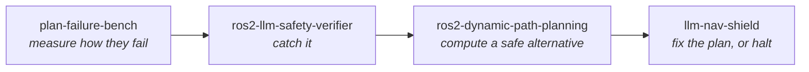

# Munawar Kazmi

### Robotics & AI Research Engineer

**Teaching robots to say *what they mean*, and to know *when they can't*.**

MSc AI & Robotics (Commendation) · University of Hertfordshire

---

| **4.3x** | **0 / 2,151** | **32 / 32** |
| :---: | :---: | :---: |
| faster replanning D* Lite vs A*, 200 seeded trials | unsafe trajectories missed by my LLM safety verifier | certified legibility bounds holding every world, every budget |

**Every number here is checkable.** Each is produced by committed code and re-verified in CI on every push.
**One of them was withdrawn.** When the evidence behind an earlier claim was lost, the claim came down
rather than being restated on trust, and the withdrawal is still published beside it.

## Saying what they mean

A robot that signals where it is going is easier to work beside, and that clarity is not free. One
project bounds it, the other prices it.

The cheapest route clips the keep-out zone. Every legible one avoids it, and pays for the clarity
in arrival time. All four are on one clock, so the one that paid is seen arriving last. Rendered from
committed scenarios by the benchmark's own tool.

- **[legibility-bounds](https://github.com/munawarkazmi/legibility-bounds):** certified two-sided bounds on how legible a trajectory can be under a path budget, quantified over every admissible trajectory rather than the ones somebody searched. 32 world-ceiling pairs, 0 violations. Submitted to IEEE RA-L, [preprint](https://doi.org/10.5281/zenodo.21834955).
- **[legible-motion-bench](https://github.com/munawarkazmi/legible-motion-bench):** two models called all 80 of their trajectories legible. 25 were not physically possible. What clarity costs in safety and path length, measured with no judging anywhere.

## Knowing when they can't

Language models are being handed control of things that move. One line of work, not five projects:
measure how the models fail, catch it, compute a correct alternative, then choose between fixing the
plan and stopping.

A real run on the repository's occupancy map. A* expands 125,760 nodes for the first plan; 
D* Lite repairs it around the new obstacle by expanding 256.

- **[plan-failure-bench](https://github.com/munawarkazmi/plan-failure-bench):** how LLM planners fail at robot tasks, not just how often. 60 trap-labelled instructions, ground truth decidable end to end, no human or model judging anywhere, 548 proofs re-run in CI. [Preprint](https://doi.org/10.5281/zenodo.21756817).
- **[ros2-llm-safety-verifier](https://github.com/munawarkazmi/ros2-llm-safety-verifier):** zero misses, zero false positives. A deterministic gate between the model and Nav2 at microsecond latency, catching 35/35 unsafe qwen2.5-7B and 32/32 unsafe llama-3.3-70B trajectories.
- **[ros2-dynamic-path-planning](https://github.com/munawarkazmi/ros2-dynamic-path-planning):** A* and D* Lite as Nav2 plugins over a ROS-free C++20 core. 4.3x faster replans on average, validated against Dijkstra across 185,237 fuzzed cases.
- **[llm-nav-shield](https://github.com/munawarkazmi/llm-nav-shield):** the three composed into verify, recover, or halt when nothing safe exists. 38/38 flawed plans recovered, 0 unsafe forwarded, then replayed on three public ROS bags where real costmaps break assumptions the synthetic ones never could.
- **[toolcall-contract](https://github.com/munawarkazmi/toolcall-contract):** the same question away from robots. Two layers for LLM tool calls, where the semantic layer catches 7 contract breaks that the schema layer scores as clean.

## Foundations, and things already running

- **[exact-predicates](https://github.com/munawarkazmi/exact-predicates):** geometric predicates that cannot be wrong, grown from a real key-tie bug in my own D* Lite. 657 adversarial cases where CI asserts the float version is wrong and the exact one is right. Exactness costs about 2x, measured.
- **[degregorio-blowup](https://github.com/munawarkazmi/degregorio-blowup):** finite-time blowup in a 1D model for 3D Euler. Regressing an unknown constant against a known one cancels the discretisation error and collapses the spread 800-fold: `beta = 3.0024227 +/- 5e-6`, excluding the natural guess of exactly 3.
- **[safina-portal-showcase](https://github.com/munawarkazmi/safina-portal-showcase):** school management system in production for a real institute. Seven roles, admissions, prorated cash billing, payroll, and an append-only audit trail written by triggers. Built, shipped and operated solo.
- **[esp32-cam-motion-detector](https://github.com/munawarkazmi/esp32-cam-motion-detector):** deterministic motion-detection firmware from a commercial prototype. No ML, no vision libraries, compiled for the target board in CI on every push.

## Toolbox

Robotics and systems, edge AI and embedded, full-stack

 

**Robotics and systems**

**Edge AI and embedded**

**Full-stack**

## Currently

- Extending plan-failure-bench's k=5 sampling to the remaining grid cells, the single change that would most strengthen its claims
- Carrying the legibility-bounds submission through RA-L review
- Running a production school platform used daily by students, teachers and staff
- **Open to research collaborations and PhD opportunities** in robotics and trustworthy AI

**[munawarkazmi.com](https://munawarkazmi.com)**

